# Visual Knowledge Graph: Preparation Methods

*Dynamic visualization of medicinal plants organized by optimal preparation techniques*

---

## Preparation Method Networks

### _PREPARATION-METHODS → Preparation Methods → Individual Plants

**This page connects ONLY to preparation method hubs:**

[[Tea-Infusion]] - [[Decoction]] - [[Tincture]] - [[Topical-Application]] - [[Culinary-Medicine]] - [[Capsule-Extract]] - [[Essential-Oil]]

---

```mermaid
graph TB
    subgraph "TEA/INFUSION (Hot Water)"
        T1[Chamomile<br/>05-Chamomile.md<br/>Gentle flowers]
        T2[Peppermint<br/>12-Peppermint.md<br/>Fresh/dried leaves]
        T3[Nettle<br/>53-Nettle.md<br/>Nutritive leaves]
        T4[Lemon Balm<br/>52-Lemon-Balm.md<br/>Aromatic leaves]
        T5[Red Clover<br/>26-Red-Clover.md<br/>Flower heads]
        T6[Lavender<br/>11-Lavender.md<br/>Flower buds]
        T7[Holy Basil<br/>23-Holy-Basil.md<br/>Leaves/flowers]
        T8[Elderberry<br/>18-Elderberry.md<br/>Dried berries]
        T9[Yarrow<br/>59-Yarrow.md<br/>Aerial parts]
    end

    subgraph "DECOCTION (Simmered)"
        DC1[Licorice<br/>31-Licorice.md<br/>Roots]
        DC2[Burdock<br/>55-Burdock.md<br/>Roots]
        DC3[Willow Bark<br/>13-Willow-Bark.md<br/>Inner bark]
        DC4[Astragalus<br/>19-Astragalus.md<br/>Root slices]
        DC5[Ginger<br/>03-Ginger.md<br/>Fresh/dried root]
        DC6[Turmeric<br/>02-Turmeric.md<br/>Fresh/dried root]
        DC7[Cinnamon<br/>42-Cinnamon.md<br/>Bark pieces]
        DC8[Elecampane<br/>35-Elecampane.md<br/>Roots]
    end

    subgraph "TINCTURE (Alcohol Extract)"
        TR1[Echinacea<br/>01-Echinacea.md<br/>Fresh/dried root]
        TR2[St Johns Wort<br/>09-St-Johns-Wort.md<br/>Fresh flowers]
        TR3[Valerian<br/>14-Valerian.md<br/>Fresh/dried root]
        TR4[Milk Thistle<br/>15-Milk-Thistle.md<br/>Seeds]
        TR5[Goldenseal<br/>61-Goldenseal.md<br/>Roots]
        TR6[Black Cohosh<br/>25-Black-Cohosh.md<br/>Roots]
        TR7[Chaste Tree<br/>28-Chaste-Tree.md<br/>Berries]
        TR8[Rhodiola<br/>21-Rhodiola.md<br/>Roots]
        TR9[Ashwagandha<br/>22-Ashwagandha.md<br/>Roots]
    end

    subgraph "TOPICAL (External Use)"
        TO1[Aloe Vera<br/>07-Aloe-Vera.md<br/>Fresh gel]
        TO2[Calendula<br/>10-Calendula.md<br/>Oil infusion]
        TO3[Comfrey<br/>60-Comfrey.md<br/>Leaf poultice]
        TO4[Plantain<br/>58-Plantain.md<br/>Fresh leaves]
        TO5[Witch Hazel<br/>65-Witch-Hazel.md<br/>Distillate/wash]
        TO6[Yarrow<br/>59-Yarrow.md<br/>Fresh poultice]
        TO7[Arnica<br/>Montana<br/>Oil/salve]
        TO8[Lavender<br/>11-Lavender.md<br/>Essential oil]
    end

    subgraph "CULINARY (Food as Medicine)"
        C1[Turmeric<br/>02-Turmeric.md<br/>Golden milk/curry]
        C2[Ginger<br/>03-Ginger.md<br/>Fresh in cooking]
        C3[Garlic<br/>06-Garlic.md<br/>Raw/cooked cloves]
        C4[Cinnamon<br/>42-Cinnamon.md<br/>Spice/tea]
        C5[Sage<br/>38-Sage.md<br/>Culinary herb]
        C6[Thyme<br/>39-Thyme.md<br/>Cooking/seasoning]
        C7[Rosemary<br/>37-Rosemary.md<br/>Culinary use]
        C8[Fennel<br/>32-Fennel.md<br/>Seeds/bulb]
        C9[Basil<br/>41-Basil.md<br/>Fresh leaves]
    end

    subgraph "CAPSULES/STANDARDIZED"
        CS1[Ginkgo<br/>08-Ginkgo.md<br/>Standardized extract]
        CS2[Ginseng<br/>04-Ginseng.md<br/>Root powder]
        CS3[Saw Palmetto<br/>16-Saw-Palmetto.md<br/>Berry extract]
        CS4[Evening Primrose<br/>71-Evening-Primrose.md<br/>Seed oil]
        CS5[Milk Thistle<br/>15-Milk-Thistle.md<br/>Silymarin extract]
        CS6[Cranberry<br/>17-Cranberry.md<br/>Concentrated extract]
        CS7[Reishi<br/>20-Reishi-Mushroom.md<br/>Powder/extract]
    end

    subgraph "ESSENTIAL OILS"
        EO1[Lavender<br/>11-Lavender.md<br/>Steam distilled]
        EO2[Peppermint<br/>12-Peppermint.md<br/>Menthol oil]
        EO3[Tea Tree<br/>Melaleuca<br/>Antiseptic oil]
        EO4[Eucalyptus<br/>Respiratory oil]
        EO5[Oregano<br/>40-Oregano.md<br/>Antimicrobial oil]
        EO6[Thyme<br/>39-Thyme.md<br/>Thymol oil]
        EO7[Rosemary<br/>37-Rosemary.md<br/>Memory oil]
    end

    %% Method cross-connections
    T5 -.-> TR8
    T9 -.-> TO6
    DC5 -.-> C2
    DC6 -.-> C1
    TR2 -.-> TO8
    C4 -.-> DC7
    TO2 -.-> T6

    %% Style the preparation methods
    classDef tea fill:#E6FFE6,stroke:#228B22,stroke-width:2px
    classDef decoction fill:#8B4513,stroke:#654321,stroke-width:2px,color:#fff
    classDef tincture fill:#FFE4B5,stroke:#DAA520,stroke-width:2px
    classDef topical fill:#E0FFFF,stroke:#008B8B,stroke-width:2px
    classDef culinary fill:#FFF8DC,stroke:#FF8C00,stroke-width:2px
    classDef capsules fill:#F0F8FF,stroke:#4169E1,stroke-width:2px
    classDef oils fill:#E6E6FA,stroke:#8A2BE2,stroke-width:2px

    class T1,T2,T3,T4,T5,T6,T7,T8,T9 tea
    class DC1,DC2,DC3,DC4,DC5,DC6,DC7,DC8 decoction
    class TR1,TR2,TR3,TR4,TR5,TR6,TR7,TR8,TR9 tincture
    class TO1,TO2,TO3,TO4,TO5,TO6,TO7,TO8 topical
    class C1,C2,C3,C4,C5,C6,C7,C8,C9 culinary
    class CS1,CS2,CS3,CS4,CS5,CS6,CS7 capsules
    class EO1,EO2,EO3,EO4,EO5,EO6,EO7 oils
```

## Preparation Method Guidelines

### Tea/Infusion (Hot Water Extraction)
**Best For**: Delicate flowers, leaves, aromatic compounds
**Method**: Pour boiling water over plant material, steep 5-15 minutes
**Ratio**: 1 tsp dried herb per cup water
**Plants**: 
- **Flowers**: Chamomile, Calendula, Lavender, Red Clover
- **Leaves**: Peppermint, Nettle, Lemon Balm, Holy Basil
- **Aerial Parts**: Yarrow, Skullcap

### Decoction (Simmered Extraction)
**Best For**: Roots, bark, hard plant materials
**Method**: Simmer plant material in water 15-30 minutes
**Ratio**: 1 Tbsp dried root per cup water
**Plants**:
- **Roots**: Licorice, Burdock, Astragalus, Ginger, Turmeric
- **Bark**: Willow, Cinnamon, Wild Cherry
- **Hard Materials**: Elecampane root, Oak bark

### Tincture (Alcohol Extraction)
**Best For**: Alkaloids, resins, concentrated preparations
**Method**: Soak plant material in alcohol (40-50%) for 2-4 weeks
**Ratio**: 1:5 (plant:alcohol) for dried, 1:2 for fresh
**Plants**:
- **Roots**: Echinacea, Valerian, Goldenseal, Rhodiola, Ashwagandha
- **Flowers**: St. John's Wort (fresh)
- **Seeds**: Milk Thistle
- **Berries**: Chaste Tree

### Topical Applications
**Best For**: Skin conditions, wounds, localized treatment
**Methods**: 
- **Fresh Poultice**: Plantain, Comfrey leaves
- **Oil Infusion**: Calendula, St. John's Wort
- **Fresh Gel**: Aloe Vera
- **Distillate**: Witch Hazel
- **Essential Oil**: Lavender, Tea Tree

### Culinary Medicine
**Best For**: Daily intake, prevention, gentle action
**Methods**:
- **Spice Blends**: Turmeric, Ginger, Cinnamon
- **Fresh Cooking**: Garlic, Basil, Sage
- **Seasoning**: Thyme, Oregano, Rosemary
- **Seed Spices**: Fennel, Coriander, Cumin

### Capsules/Standardized Extracts
**Best For**: Precise dosing, standardized compounds
**Forms**:
- **Powdered**: Ginseng, Reishi
- **Standardized**: Ginkgo (24% flavonoids), Milk Thistle (80% silymarin)
- **Oil Capsules**: Evening Primrose, Borage
- **Concentrated**: Cranberry, Saw Palmetto

## Preparation Compatibility Matrix

### Multi-Method Plants
Plants that work well with multiple preparation methods:

**Ginger**: 
- Fresh: Culinary, tea
- Dried: Decoction, capsules
- Oil: Topical applications

**Turmeric**:
- Fresh: Culinary, juice
- Dried: Decoction, capsules
- Oil: Topical anti-inflammatory

**Lavender**:
- Flowers: Tea, topical oil infusion
- Essential oil: Aromatherapy, topical
- Dried: Sachets, bath preparations

**Yarrow**:
- Fresh: Poultice for wounds
- Dried: Tea for fever
- Tincture: Internal bleeding

### Method Selection Guide

**For Acute Conditions**:
- Digestive upset: Fresh ginger tea
- Cuts/wounds: Fresh plantain poultice
- Anxiety: Valerian tincture
- Nausea: Fresh ginger chew

**For Chronic Conditions**:
- Heart support: Hawthorn standardized extract
- Liver support: Milk thistle standardized
- Immune building: Astragalus decoction
- Stress adaptation: Ashwagandha capsules

**For Prevention**:
- Daily antioxidants: Green tea, turmeric in food
- Immune support: Elderberry syrup
- Cardiovascular: Garlic in cooking
- Cognitive: Ginkgo standardized extract

### Extraction Strength Hierarchy
**Strongest to Gentlest**:
1. **Essential Oils** - Highly concentrated
2. **Tinctures** - Alcohol-extracted concentrates
3. **Standardized Extracts** - Specific compound levels
4. **Decoctions** - Hot water extraction of tough materials
5. **Teas/Infusions** - Gentle hot water extraction
6. **Culinary Use** - Mildest, food-level dosing

### Safety by Preparation Method

**Safest**:
- Culinary use of food plants
- Gentle teas (chamomile, peppermint)
- External applications (aloe, calendula)

**Moderate Care**:
- Decoctions of common roots
- Standardized extracts with known dosing
- Tinctures of well-researched plants

**Greatest Care**:
- Essential oils (can be toxic in large amounts)
- Tinctures of potent plants (goldenseal, black cohosh)
- Fresh preparations of unknown plants

---

**Navigation**: [[INDEX.md]] | [[_PLANT-FAMILIES]] | [[_TRADITIONAL-USES]]